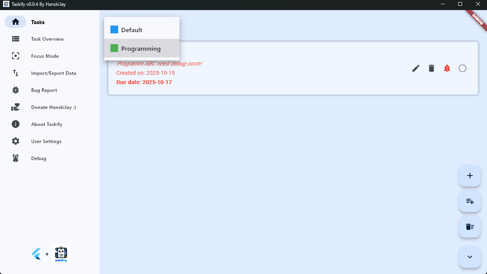
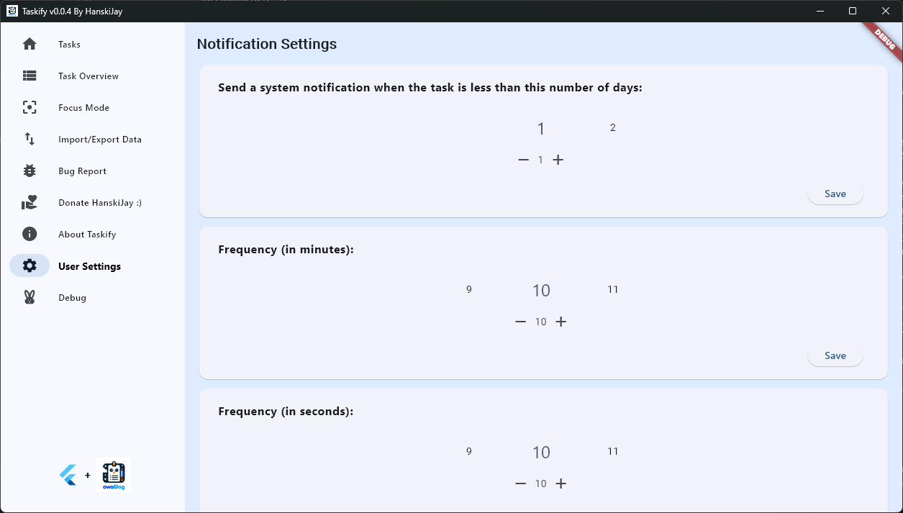

# 📝 Taskify — Eine intelligente ToDoList-App mit Flutter entwickelt

**Taskify** ist eine moderne, leichte und benutzerfreundliche ToDoList-Anwendung, die mit **Dart** und **Flutter** entwickelt wurde.
Der Fokus liegt auf **Einfachheit**, **Benutzererfahrung** und **dauerhafter Datenspeicherung**, was sie zu einem idealen Produktivitätstool für Entwickler und Studierende macht.

---

## 🌟 Hauptfunktionen

### 🧩 1. Dynamische Kategorienverwaltung

- Benutzer können Kategorien problemlos **erstellen**, **umbenennen** und **löschen**.
- Werden Kategorien gelöscht, werden die darin enthaltenen Aufgaben automatisch der Kategorie **„Default“** zugeordnet.
- Jede Kategorie hat eine eigene Farbcodierung für bessere Übersichtlichkeit.

### 📋 2. Erweiterte Aufgabenverfolgung

- Speichert **Erstellungsdatum**, **Fälligkeitsdatum** und den **Wichtigkeitsstatus** einer Aufgabe.
- Aufgaben lassen sich direkt bearbeiten und zwischen Kategorien verschieben.
- Wichtige Aufgaben werden visuell hervorgehoben.

### ✅ 3. Intuitive Aufgabenverwaltung

- Aufgaben können mit einem einzigen Klick als erledigt markiert werden.
- Kategorien können bequem über ein Dropdown-Menü gewechselt werden.
- Eine klare, moderne Benutzeroberfläche sorgt für ein fokussiertes Arbeitserlebnis.

### 💾 4. Dauerhafte Datenspeicherung

- Alle Aufgaben und Kategorien werden lokal in einer JSON-Datei (`todoList.json`) gespeichert.
- Daten bleiben zwischen Sitzungen erhalten.
- Aufgaben können **importiert/exportiert** werden, um Backups oder Transfers zu ermöglichen.

---

## 🧠 App-Vorschau

Hier sind die wichtigsten Benutzeroberflächen mit Screenshots dargestellt:

### 🏠 Startbildschirm

Zeigt die aktuelle Kategorie und die zugehörigen Aufgaben an.


---

### 🗂️ Mehrere Kategorien

Wechsle einfach zwischen Gruppen wie „Default“ und „Programming“.


---

### 📊 Aufgabenübersicht

Zeigt alle aktiven Aufgaben kategorisiert an und hebt wichtige Aufgaben hervor.


---

### 🎯 Fokusmodus

Blendet erledigte Aufgaben aus und hilft, konzentriert zu bleiben.


---

### 🔄 Datenimport / -export

Importiere oder exportiere Aufgaben im JSON-Format.


---

### ⚙️ Benutzereinstellungen

Passe Benachrichtigungen und Aktualisierungsintervalle an.


---

## 🛠️ Installation & Einrichtung

1. **Repository klonen**

   ```bash
   git clone https://github.com/Tommy131/Taskify.git
   cd Taskify
   ```

2. **Abhängigkeiten installieren**

   ```bash
   flutter pub get
   ```

3. **App ausführen**

   ```bash
   flutter run
   ```

   oder für das gewünschte Zielsystem:

   ```bash
   flutter build
   ```

4. *(Optional)* Backend verbinden: [Taskify-Go](https://github.com/Tommy131/OwOWeb-Go/tree/main/modules/taskify)

---

## 📂 Beispiel für Datenstruktur

```json
{
  "Default": [
    {
      "uid": 1439868357,
      "title": "Test",
      "remark": "Dies ist eine Testaufgabe",
      "category": "Default",
      "creationDate": "2025-10-15T13:37:47.113890",
      "dueDate": "2025-11-01T12:00:00.000",
      "isCompleted": false,
      "isImportant": false
    }
  ],
  "Programming": [
    {
      "uid": 1507718356,
      "title": "DEBUG",
      "remark": "Programm ABC muss bald debuggt werden!",
      "category": "Programming",
      "creationDate": "2025-10-15T13:41:35.862854",
      "dueDate": "2025-10-17T13:41:20.066985",
      "isCompleted": false,
      "isImportant": true
    }
  ]
}
```

---

## 🧾 Lizenz

Dieses Projekt steht unter der **GNU Affero General Public License v3.0 (AGPL-3.0)**.
Weitere Informationen findest du in der Datei [LICENSE](public/LICENSE).

---

## 🧑‍💻 Autor

**HanskiJay**
© 2024 — Entwickelt als Teil des **Abitur-Abschlussprojekts in Deutschland**.
Die Nutzung zu anderen als Lernzwecken ist strengstens untersagt.

> 本项目为德国2024年高考毕业设计项目，严禁用于除学习以外的任何用途！
