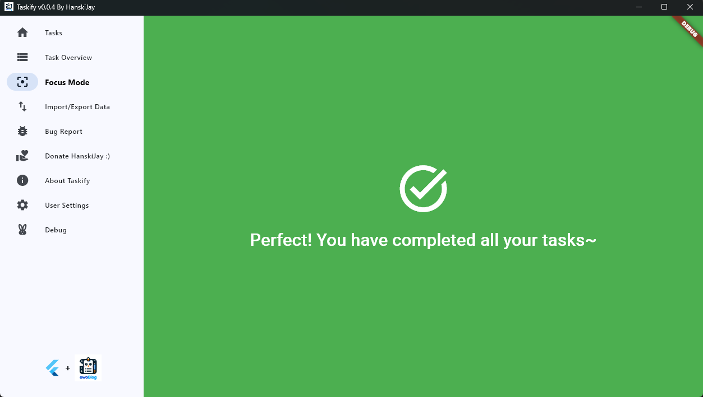

# 📝 Taskify — 基于 Flutter 的智能待办事项应用

**Taskify** 是一款由 **Dart** 与 **Flutter** 开发的现代化轻量级待办事项应用。
它以 **简洁设计**、**易用交互** 与 **数据持久化** 为核心，让用户高效管理任务，保持专注。

---

## 🌟 功能亮点

### 🧩 1. 动态分类管理

- 可自由添加、重命名与删除任务分类。
- 删除分类时，其任务将自动移入 **默认分类（Default）**。
- 每个分类都有独立颜色标识，直观清晰。

### 📋 2. 高级任务追踪

- 记录任务的 **创建时间**、**截止日期** 与 **重要性状态**。
- 支持任务编辑与跨分类调整。
- 可为重要任务添加醒目标识。

### ✅ 3. 直观的任务管理

- 单击即可标记任务完成。
- 可通过下拉菜单切换不同分类。
- 极简清晰的界面设计，让专注更轻松。

### 💾 4. 本地数据持久化

- 所有任务数据均存储于本地 JSON 文件 (`todoList.json`)。
- 自动保存与加载，确保数据安全可靠。
- 支持 **任务导入/导出**，便于备份与迁移。

---

## 🧠 应用界面预览

### 🏠 主界面

展示当前分类下的任务。


---

### 🗂️ 多分类视图

快速切换至 “Default” 或 “Programming”等任务组。


---

### 📊 任务总览

整合展示所有任务，突出重要项。


---

### 🎯 专注模式

隐藏已完成任务，专注当前工作。


---

### 🔄 数据导入 / 导出

支持 JSON 文件的任务导入与导出。


---

### ⚙️ 用户设置

自定义通知触发时间与刷新间隔。


---

## 🛠️ 安装与运行

1. **克隆项目**

   ```bash
   git clone https://github.com/Tommy131/Taskify.git
   cd Taskify
   ```

2. **安装依赖**

   ```bash
   flutter pub get
   ```

3. **运行应用**

   ```bash
   flutter run
   ```

   或构建平台版本：

   ```bash
   flutter build
   ```

4. *(可选)* 连接后端模块：[Taskify-Go](https://github.com/Tommy131/OwOWeb-Go/tree/main/modules/taskify)

---

## 📂 数据文件示例

```json
{
  "Default": [
    {
      "uid": 1439868357,
      "title": "Test",
      "remark": "This is a Test Task",
      "category": "Default",
      "creationDate": "2025-10-15T13:37:47.113890",
      "dueDate": "2025-11-01T12:00:00.000",
      "isCompleted": false,
      "isImportant": false
    }
  ],
  "Programming": [
    {
      "uid": 1507718356,
      "title": "DEBUG",
      "remark": "Program ABC need debug soon!",
      "category": "Programming",
      "creationDate": "2025-10-15T13:41:35.862854",
      "dueDate": "2025-10-17T13:41:20.066985",
      "isCompleted": false,
      "isImportant": true
    }
  ]
}
```

---

## 🧾 开源许可

本项目采用 **GNU Affero General Public License v3.0 (AGPL-3.0)** 协议。
详情请参阅 [LICENSE](public/LICENSE)。

---

## 🧑‍💻 作者信息

**HanskiJay**
© 2024 — 德国高中毕业设计项目（Abitur Abschlussprojekt）
仅限学习与研究用途，严禁商业或其他使用。

> This project is a graduation design project for the German Abitur Examination in 2024.
> It is strictly prohibited to be used for any purpose other than learning!
