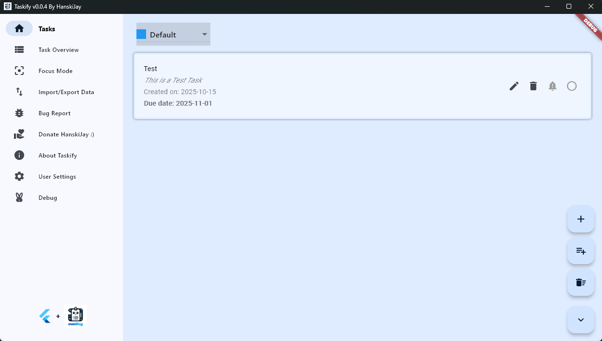
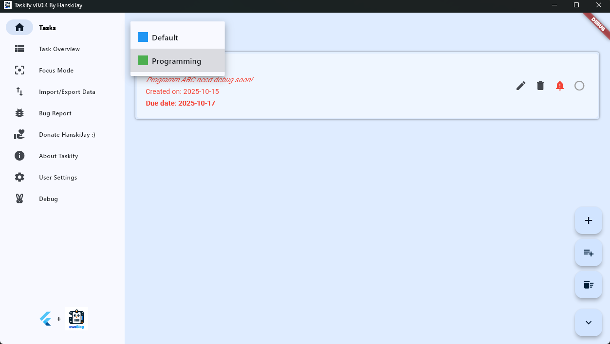
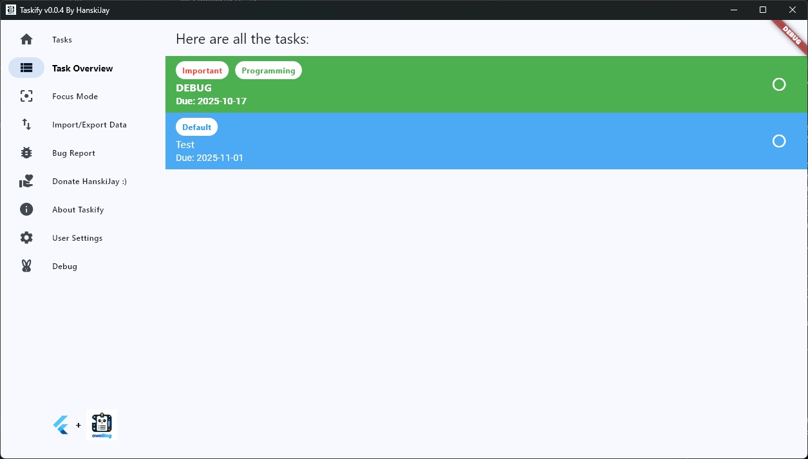
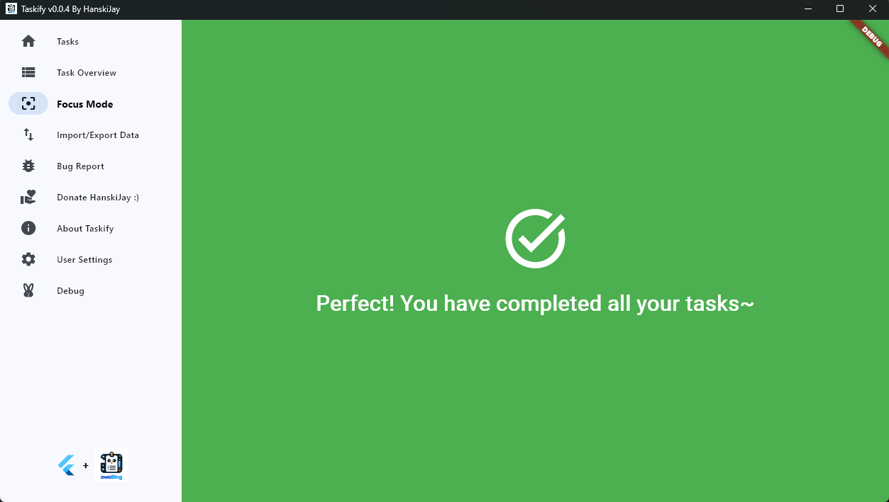
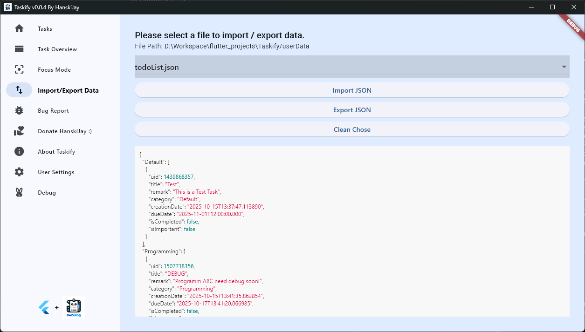
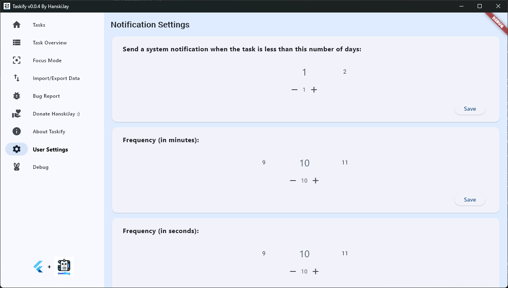

# 📝 Taskify — A Smart ToDoList App Built with Flutter

Taskify is a modern, lightweight, and visually polished ToDoList application built using **Dart** and **Flutter**.
It focuses on **simplicity**, **usability**, and **data persistence**, making it an excellent productivity companion for developers and students alike.

---

## 🌟 Features Overview

### 🧩 1. Dynamic Category Management

- Create, rename, and delete custom categories effortlessly.
- Tasks are automatically reassigned to the **Default** category if their original category is deleted.
- Each category has a unique color identifier for better organization.

### 📋 2. Advanced Task Tracking

- Store **creation date**, **due date**, and **task importance** status.
- Edit tasks inline and reclassify them between categories.
- Prioritize or highlight important tasks with visual indicators.

### ✅ 3. Intuitive Task Management

- Mark tasks as completed with a single click.
- Switch categories dynamically via a drop-down selector.
- Enjoy a clean, modern interface for focused productivity.

### 💾 4. Persistent Data Storage

- All tasks and categories are stored locally in a JSON file (`todoList.json`).
- Data is retained between sessions, ensuring no progress is lost.
- Users can **import/export** task data for backup or transfer.

---

## 🧠 App Preview

Below are the main UI components and their corresponding screenshots:

### 🏠 Home Screen

Displays your current category and all tasks within it.


---

### 🗂️ Multiple Categories

Switch easily between different task groups such as “Default” and “Programming.”


---

### 📊 Task Overview

Summarizes all active tasks by category and highlights important ones.


---

### 🎯 Focus Mode

Stay distraction-free — Focus Mode hides completed tasks and encourages productivity.


---

### 🔄 Import / Export Data

Easily back up or migrate tasks using JSON import/export functionality.


---

### ⚙️ User Settings

Customize notifications and refresh frequencies to fit your workflow.


---

## 🛠️ Installation & Setup

Follow the steps below to run **Taskify** locally:

1. **Clone the repository**

   ```bash
   git clone https://github.com/Tommy131/Taskify.git
   cd Taskify
   ```

2. **Install dependencies**

   ```bash
   flutter pub get
   ```

3. **Run the app**

   ```bash
   flutter run
   ```

   or build for your target platform:

   ```bash
   flutter build
   ```

4. *(Optional)* Connect with the backend module [Taskify-Go](https://github.com/Tommy131/OwOWeb-Go/tree/main/modules/taskify) for extended features.

---

## 📂 Data Format Example

Example of `todoList.json` stored in local user data:

```json
{
  "Default": [
    {
      "uid": 1439868357,
      "title": "Test",
      "remark": "This is a Test Task",
      "category": "Default",
      "creationDate": "2025-10-15T13:37:47.113890",
      "dueDate": "2025-11-01T12:00:00.000",
      "isCompleted": false,
      "isImportant": false
    }
  ],
  "Programming": [
    {
      "uid": 1507718356,
      "title": "DEBUG",
      "remark": "Program ABC need debug soon!",
      "category": "Programming",
      "creationDate": "2025-10-15T13:41:35.862854",
      "dueDate": "2025-10-17T13:41:20.066985",
      "isCompleted": false,
      "isImportant": true
    }
  ]
}
```

---

## 🧾 License

This project is licensed under the **GNU Affero General Public License v3.0 (AGPL-3.0)**.
Please refer to the [LICENSE](./LICENSE) file for details.

---

## 🧑‍💻 Author

**HanskiJay**
© 2024 — Developed as part of the **German Abitur Graduation Design Project**.
Strictly prohibited for use beyond educational purposes.

> 本项目为德国2024年高考毕业设计项目，严禁用于除学习以外的任何用途！
> Dieses Projekt ist ein Abschlussentwurf für das Abitur 2024 und darf ausschließlich zu Lernzwecken verwendet werden.
